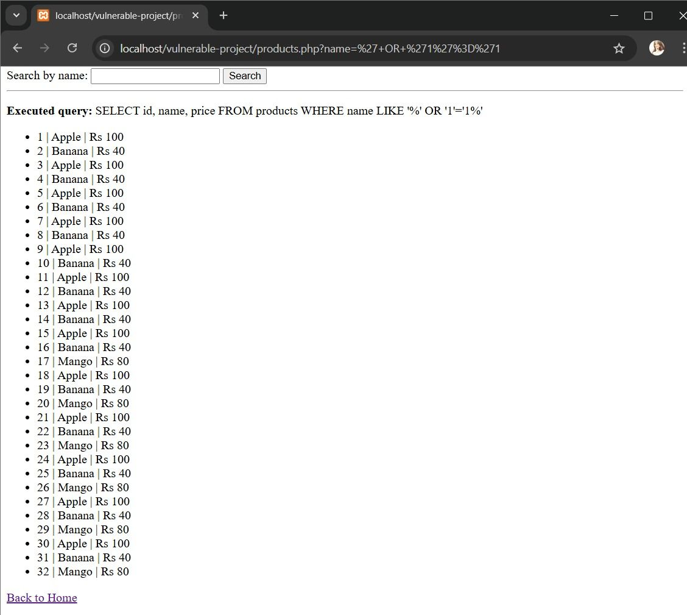
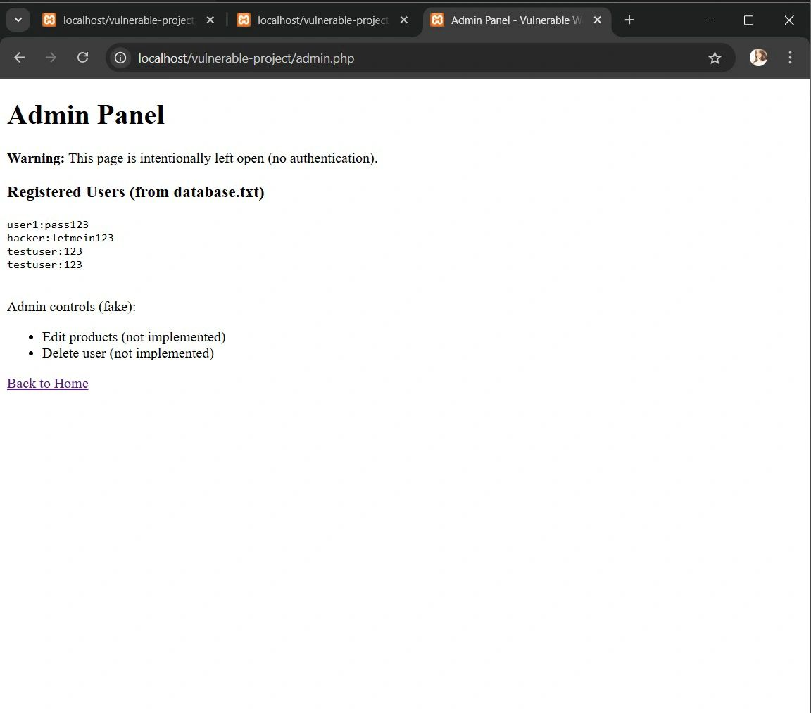
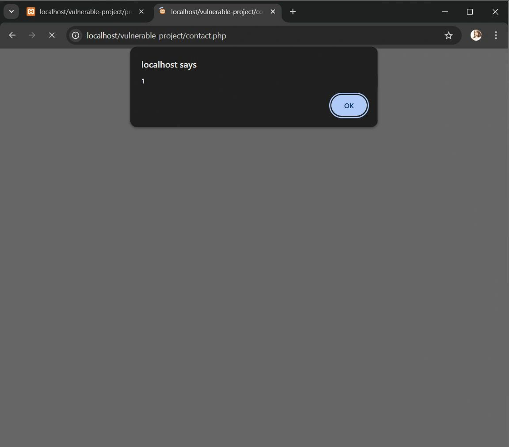
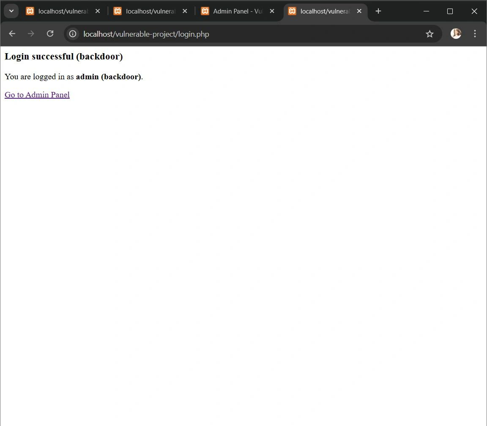
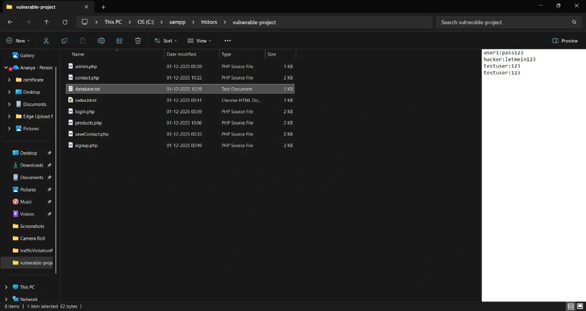
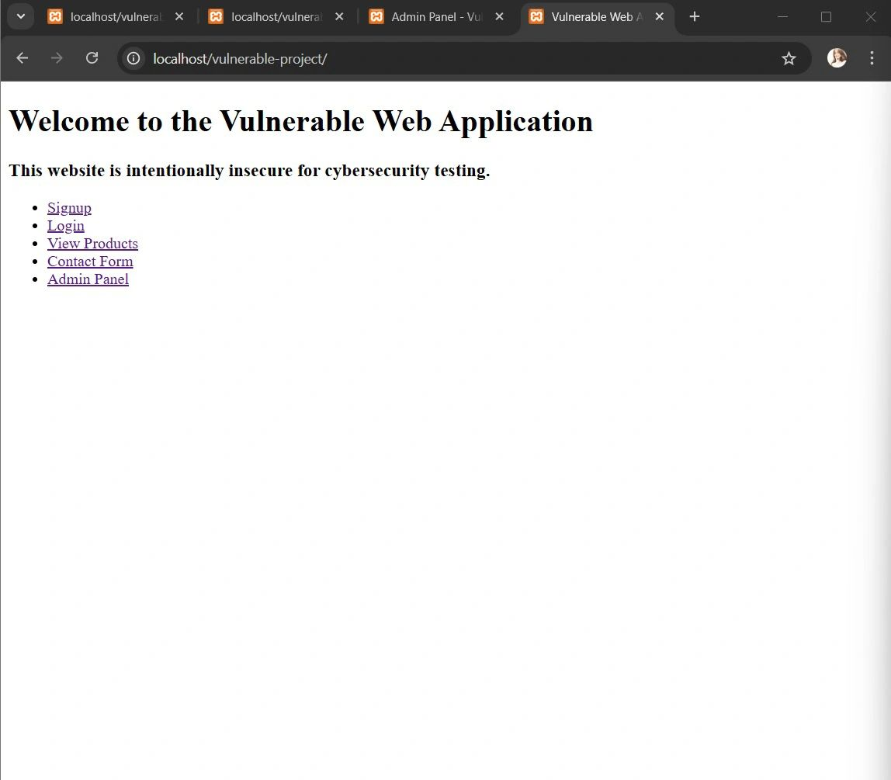

# Vulnerable_Web_App_demo
A deliberately vulnerable web application built for cybersecurity learning and demonstration.
# Vulnerable Web Application Demo

This project is a deliberately vulnerable web application built for learning and demonstrating common cybersecurity flaws.

## Vulnerabilities Demonstrated
- **SQL Injection** – manipulating queries through user input
- **Cross-Site Scripting (XSS)** – injecting malicious scripts into forms
- **Plaintext Password Storage** – insecure credential handling
- **Broken Access Control** – accessing admin panel without authentication
- **Misconfiguration** – directory listing enabled

## Project Files
- `admin.php` → Admin panel left open without authentication
- `login.php` → Backdoor login vulnerability
- `products.php` → SQL injection demo
- `contact.php` → Stored XSS demo
- `database.txt` → Plaintext credentials
- `index.html` → Landing page
- `signup.php` / `saveContact.php` → Supporting forms

## Screenshots

- **SQL Injection**  
    
  *This shows how `' OR '1'='1` query bypasses login.*

- **Admin Panel Open Without Login**  
    
  *This demonstrates broken access control — admin page accessible without authentication.*

- **XSS Popup**  
    
  *Stored XSS vulnerability triggering a JavaScript alert.*

- **Backdoor Login**  
    
  *Hardcoded backdoor password allows login as admin.*

- **Plaintext Password Storage**  
    
  *Credentials stored in database.txt without encryption.*

- **Welcome Page**  
    
  *Landing page of the vulnerable web application.*

## ⚠️ Disclaimer
This project is for **educational purposes only**.  
Do not deploy it on a public server.